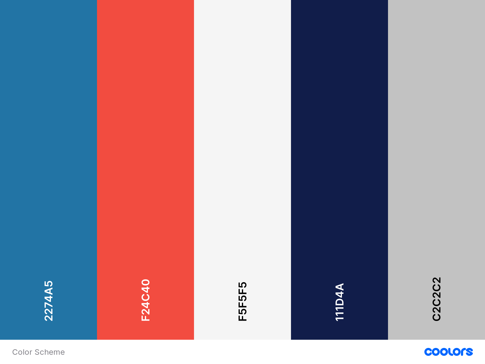
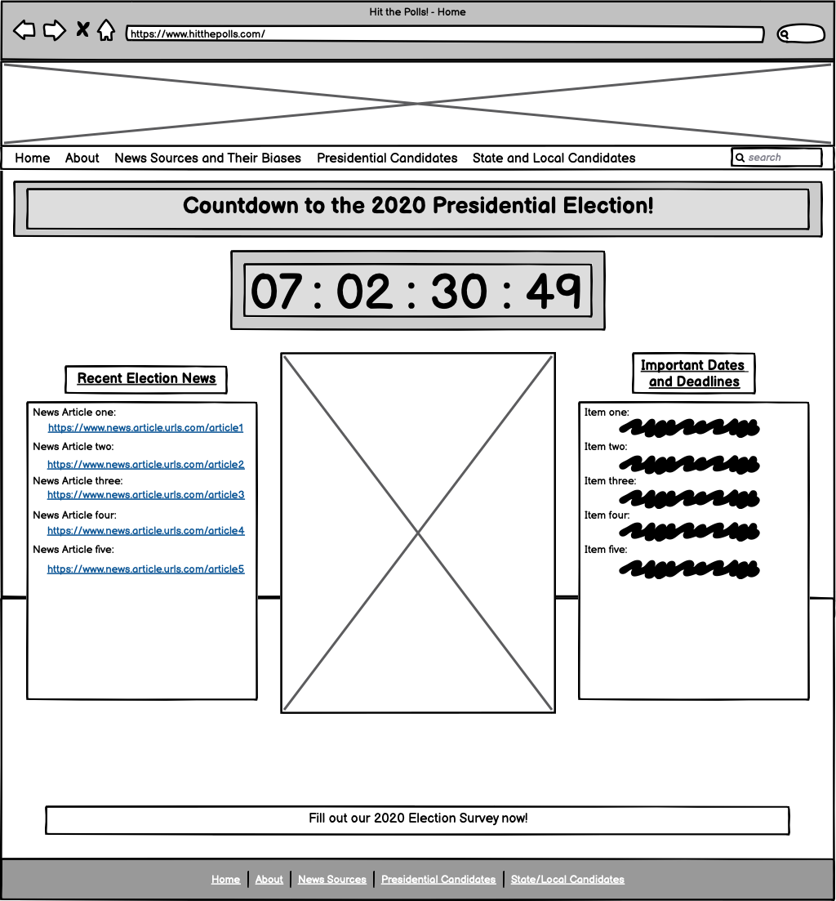
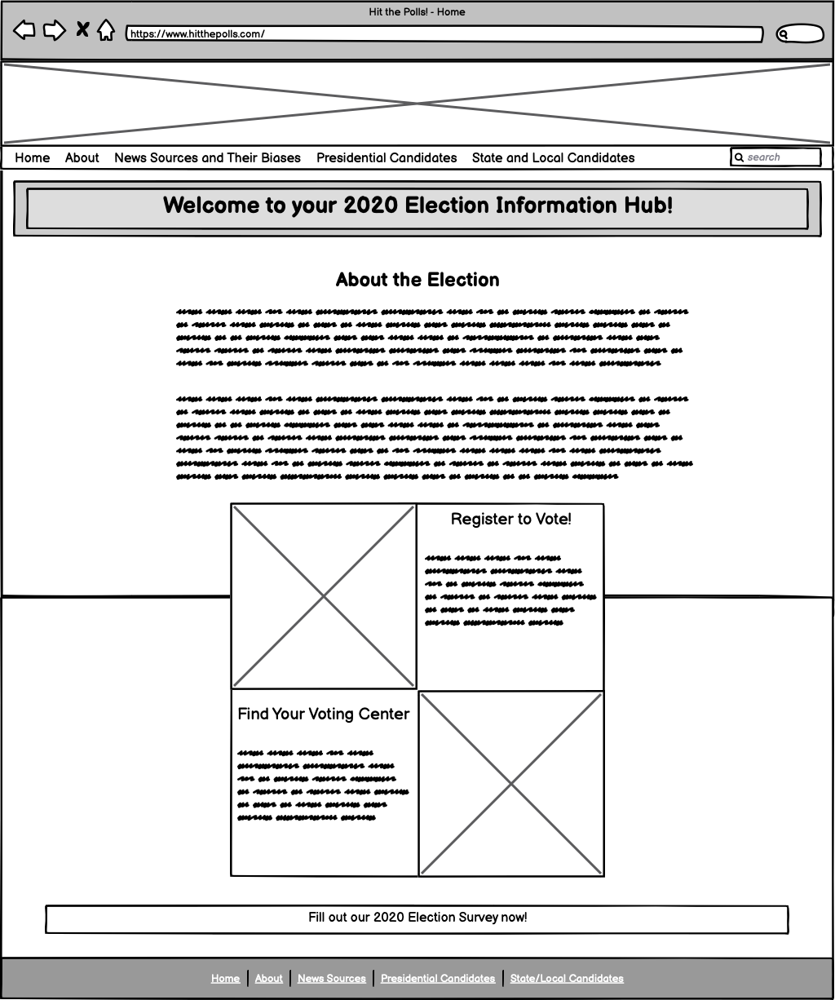
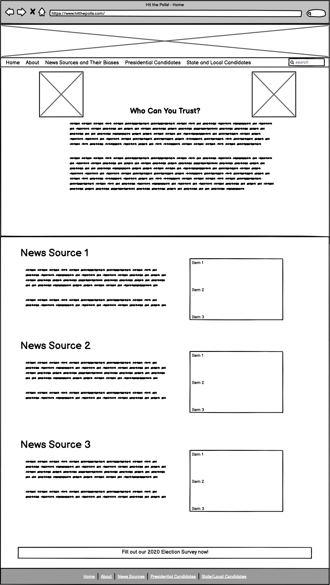
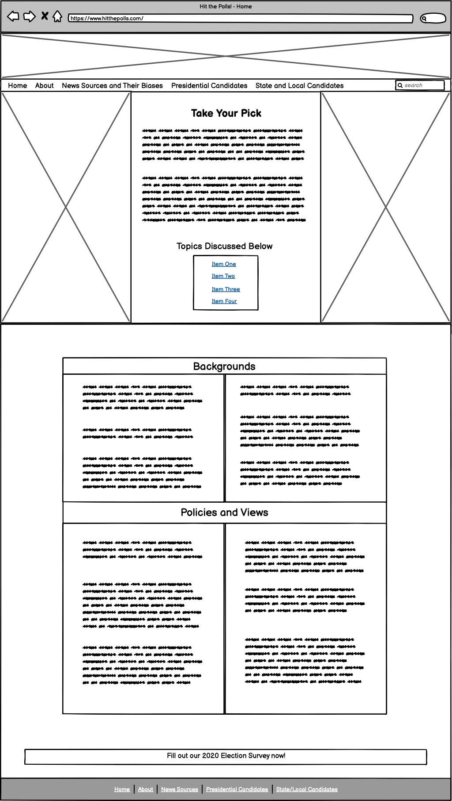
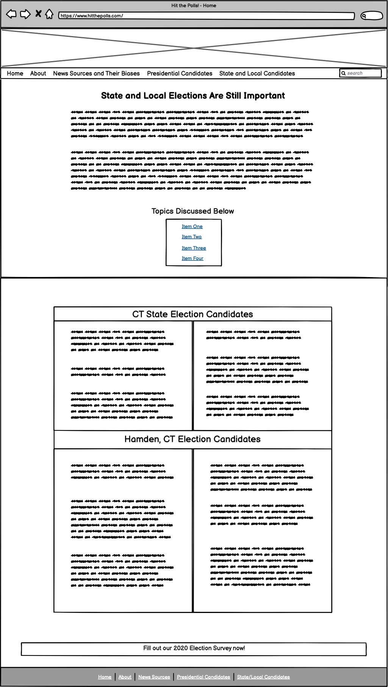

# Design Plan - hitthepolls.com

## Color Scheme

Below is the color scheme I have chosen for the site. I wanted to have similar colors to the american flag, since the site centers around the election. I chose some complementary colors that will provide some contrast where needed. 

## Wireframes - Page Layout

Below are the wireframe designs for each of the 5 pages on hitthepolls.com. Each site has the same header and footer (subject to change). The headers include the navigation bar and search bar. The footer includes links to other pages and a link to the survey. 

### Home

### About

### News Sources and Their Biases

### Presidential Comparison

### State/Local Comparison

