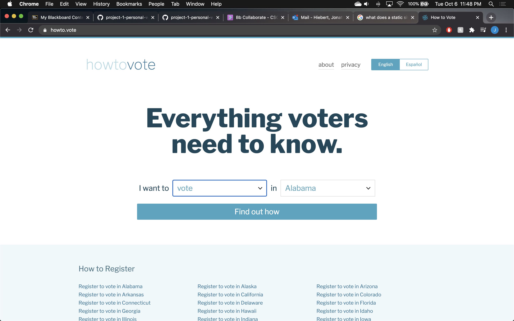
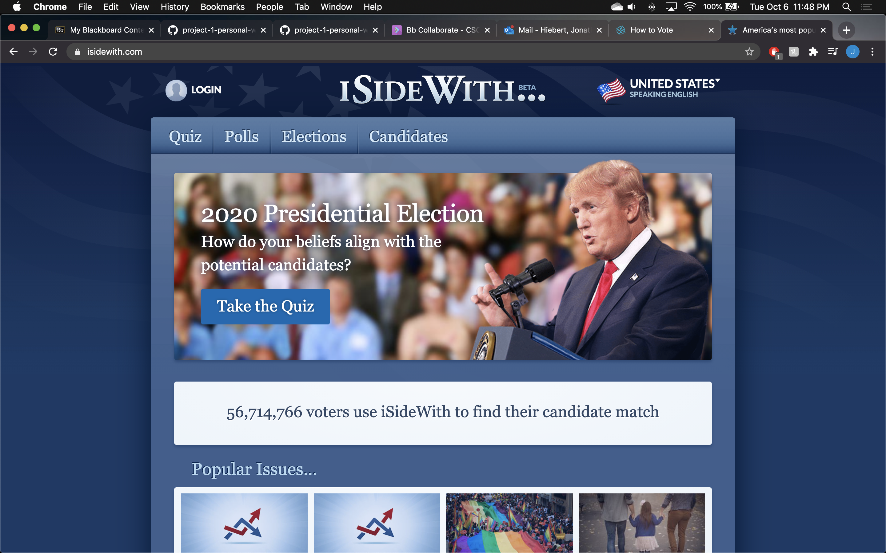
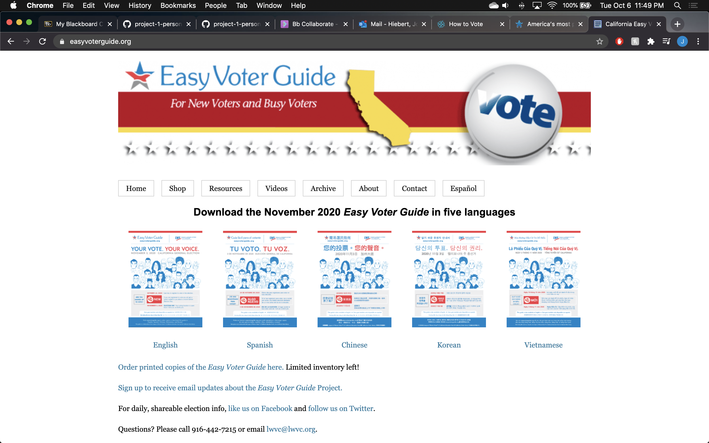

# Site Plan - hitthepolls.com

## Overview

The aim of hitthepolls.com is to compile a reliable collection of useful voting information for this upcoming Election Day. 

In today's culture, there seems to be this idea that views on political issues are binary. Democrat or Republican, Liberal or Conservative. This ideology can be confusing for many people who find themselves in the middle on certain topics. Additionally, media sources are increasingly unreliable, which forces many to resort to alternatives for of information gathering such as social media. This can lead to false information being spread because of the lack of verification on social media. This site will serve as a one-stop-shop for news about this upcoming election, including the candidates involved, news sources, and basic information about where and how to vote during the pandemic. 

A key feature for the site will be a survey function that will allow users to fill out a survey regarding information about the election. This survey will allow the user to explain who they want to vote for and why, or to ask questions about certain topics. Additionally, the site will contain several pages that outline the election details, candidate comparison, and news source credibility.

## Goals

The primary goals of the site and corresponding objectives are given below.

### Inform the Average American Voter On How and Where to Vote

* Have significantly more people who filled out the survey say they feel more educated about voting information after visiting the site, than people who say they haven't learned more. 
* Have at least 50% of users click the link that sends them to the site to learn more about where to vote for their hometown. 

### Educate Voters on Credible News Sources and Their Biases

* Have more people say they have learned more about news sources and potential biases, than people who say they haven't. 

### Educate Voters About the Candidates and Their Views

* Have significantly more people who filled out the survey say they feel more educated about the candidates after visiting the site, than people who say they haven't learned more. 

## Target Users
There are two user categories that are expected to make up the bulk of traffic to hitthepolls.com.
### Trevor - eligible voter for 2020 election

Trevor is a 30-year-old voter who usually doesn't pay attention to politics. However, with the recent push to have every eligible voter exercise their right to vote, Trevor has felt it is his responsibility to educate himself on who he should vote for based on his aligning opinions or values. Trevor comes to this site seeking information about the election deadlines, and where he should vote. 

### Erica - eligible voter for 2020 election

Erica is a 21-year-old American who usually stays up-to-date on current events and politics. She is in-tune with what has been happening over these last few months leading up to the election. She does struggle with trusting news sources and often uses social media as a news source. She comes to the site looking to learn more about the news sources and how they view things. This will help her get a better understanding of which news sources will be bias towards a certain side or policy. 

## Content

At the bottom of all pages, there will be a survey that will allow the user to inquire about more information regarding the election. Additionally, this survey will ask the user if they feel more educated on the various topics discussed on the site.

### Home

This is where most visitors will land when coming to the site. There will be links to news articles and a countdown to Election Day and other important deadlines.

### About

This page will contain a brief description of the election and will provide basic details about it. Additionally, it will contain links to other sites that can help users learn further about the election and find where their specified voting center is for their hometown. 

### News Sources and Their Biases

This page will have a rundown on popular news sources. For each source, there will be a description about which political party they tend to lean towards and how much they are bias towards that party or ideology. 

### Presidential Candidates

This page will be a comparison of the Presidential candidates and their runningmates or VPs. This comparison will focus on major policies and issues that our country is facing during these times. 

### State and Local Candidates

This page is very similar to previous page. Instead, it will outline the state and local candidates for this election. Since I am from Hamden, Connecticut, I will be focusing on the Connecticut state election and the local election. 

## Similar Sites

### howto.vote

### isidewith.com

### easyvoterguide.com

